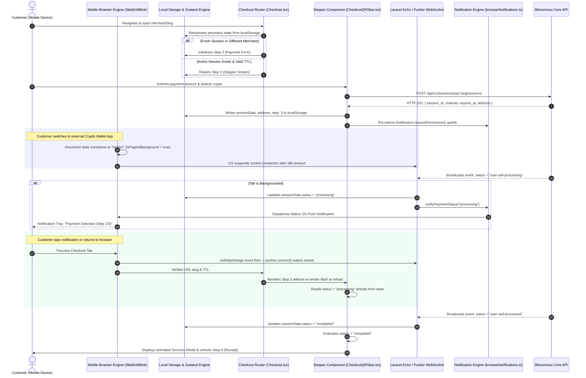

# Bitnormous Merchant Checkout Engine
## Comprehensive Architectural Specification: Resilient Stepper State, WebSocket Lifecycle, and Context-Aware Push Notifications

---

## 1. Executive Summary & Design Philosophy

The **Bitnormous Merchant Checkout Engine** is a high-reliability, client-side web application facilitating non-custodial and custodial cryptocurrency settlement for e-commerce merchants. Unlike traditional credit card checkouts where transactions complete synchronously within a 2- to 3-second HTTP roundtrip, cryptocurrency payments require multi-phase asynchronous verification:

1. **Session & Address Provisioning**: Dynamic derivation of a unique cryptocurrency deposit address and optional destination tag/memo.
2. **Mempool Detection**: Monitoring unconfirmed transactions broadcast across decentralized peer-to-peer networks.
3. **Block Confirmation & Settlement**: Waiting for consensus confirmations (e.g., Bitcoin proof-of-work or EVM block confirmations) to reach finality.

This operational reality imposes a critical UX challenge: **the customer must leave the checkout browser tab to open their mobile crypto wallet (e.g., Binance, Trust Wallet, MetaMask, Phantom, Coinbase) to complete the transfer.** 

Under standard Single Page Application (SPA) designs, navigating away from the tab or locking the mobile phone triggers aggressive operating system battery-saving routines that suspend JavaScript runtimes, terminate WebSockets, and clear volatile in-memory state. Upon refocusing, the application reloads to its initial state, discarding the user's active session and causing severe confusion.

This document formalizes the complete architecture designed to eliminate state loss, ensure persistent multi-stage stepper progression, maintain WebSocket connectivity across mobile sleep cycles, and deliver context-aware native push notifications without redundant UI friction.

---

## 2. End-to-End System Lifecycle Flow



---

## 3. Mobile Browser Execution Model & The "Reload to Start" Pathology

### 3.1 Operating System Process Lifecycles
Modern mobile operating systems—specifically **iOS (WebKit)** and **Android (Chromium)**—enforce aggressive resource management heuristics:

* **iOS WebKit Process Suspension**: When Safari or an in-app browser transitions to the background (due to screen lock, incoming call, or app switching), the execution thread is frozen within 3 to 10 seconds. Timers initialized via `setInterval` or `setTimeout` are paused, and open TCP sockets (including WebSockets) are severed by the OS.
* **Android Low Memory Killer (LMK)**: Under memory pressure, Chromium background tabs are demoted to cached processes. When the user returns, the OS restores the tab not by resuming paused memory, but by executing a fresh navigation to the document URL.
* **Development Server HMR Invalidation**: In development or tunneled environments (`cloudflared`), Vite's client-side runtime maintains an internal ping heartbeat with the dev server. When a phone wakes from sleep, the Vite client detects the severed socket, assumes the dev server has restarted or changed, and executes `window.location.reload()`.

### 3.2 The In-Memory State Failure Mode
When an application stores checkout progress solely in component state (`useState`) or non-persisted global stores:

$$\text{Active State} \xrightarrow{\text{Tab Sleep / Reload}} \text{Initial State} (\text{step: 1}) \xrightarrow{\text{Router Guard}} \text{Fallback} (\text{step: 2})$$

1. The customer initiates a payment on **Step 2**, receiving a deposit address on **Step 3**.
2. The customer switches to their wallet app to copy the address and send funds.
3. The browser suspends or discards volatile memory.
4. The customer switches back; the page triggers a cold reload.
5. The store initializes with `step: 1` and `sessionData: null`.
6. Router guards in the checkout view see an uninitialized state and forcibly reset the view to **Step 2 (the amount input form)**.
7. The customer loses visibility of their address, QR code, and confirmation progress, leading to abandoned transactions or duplicate payments.

---

## 4. Pillar 1: Persistent State Architecture (`src/store/checkoutStore.ts`)

### 4.1 Storage Engine Evaluation
To survive mobile tab discards and reloads, client-side storage mechanisms were evaluated:

| Storage Mechanism | Synchronous Hydration | Multi-Tab Isolation | Lifecycle Persistence | Selected |
| :--- | :--- | :--- | :--- | :---: |
| **Volatile Memory (RAM)** | Yes | Yes | Dies on reload/tab discard | ❌ |
| **IndexedDB** | No (Async Promise) | Shared | Permanent | ❌ (Causes UI layout flash before hydration) |
| **sessionStorage** | Yes | Per-tab | Discarded on iOS tab suspension | ❌ |
| **localStorage** | **Yes (Synchronous)** | **Shared** | **Persistent until explicitly cleared** | **✅ (Optimal)** |

`localStorage` provides **synchronous rehydration**. When React mounts the application root, Zustand reads `localStorage` synchronously during initial state creation before the initial DOM paint, guaranteeing that the router immediately perceives `step === 3` with zero layout shift or flash of unstyled content (FOUC).

### 4.2 Implementation Details
The checkout store is bound to the `persist` middleware:

```typescript
// src/store/checkoutStore.ts
import { create } from "zustand";
import { persist, createJSONStorage } from "zustand/middleware";
import { AppConfig } from "../config";
import type { EcurrencyWithMFItem, CheckoutState } from "@/interfaces";
import type { PaySessionData } from "@/interfaces/PayInterface";

const emptyPaymentState = {
  paymentAmount: 0,
  paymentAmountStr: "",
  fiatAmount: 0,
};

const emptyConfirmedState = {
  confirmedBasePaymentAmount: 0,
  confirmedPaymentAmount: 0,
  confirmedFiatAmount: 0,
};

const calcFiat = (amount: number, rate: number) =>
  Number((amount * (rate || 0)).toFixed(2));

const initialCheckoutValues = {
  step: 1,
  isDirectCheckout: false,
  isPayRoute: false,
  selectedCrypto: "BTC",
  selectedEcurrency: null as EcurrencyWithMFItem | null,
  minersFee: 0,
  currency: AppConfig.currency || "GHS",
  baseCurrency: AppConfig.baseCurrency || "USD",
  merchantId: "",
  businessId: "",
  merchantName: "",
  merchantSlug: "",
  country: "",
  sessionTtlSeconds: 900,
  ...emptyPaymentState,
  ...emptyConfirmedState,
  sessionData: null as PaySessionData | null,
  exchangeRate: 0,
};

export const useCheckoutStore = create<CheckoutState>()(
  persist(
    (set, get) => ({
      ...initialCheckoutValues,

      setStep: (step) => set({ step }),
      setIsDirectCheckout: (isDirectCheckout) => set({ isDirectCheckout }),
      setIsPayRoute: (isPayRoute) => set({ isPayRoute }),

      setSelectedCrypto: (selectedCrypto, ecurrency, minersFee) =>
        set({
          selectedCrypto,
          ...(ecurrency !== undefined ? { selectedEcurrency: ecurrency } : {}),
          ...(minersFee !== undefined ? { minersFee } : {}),
        }),

      setSelectedEcurrency: (selectedEcurrency) => set({ selectedEcurrency }),
      setMinersFee: (minersFee) => set({ minersFee }),
      setCurrency: (currency) => set({ currency }),
      setBaseCurrency: (baseCurrency) => set({ baseCurrency }),
      setMerchantId: (merchantId) => set({ merchantId, businessId: merchantId }),
      setMerchantName: (merchantName) => set({ merchantName }),
      setMerchantSlug: (merchantSlug) => set({ merchantSlug }),

      setMerchantDetails: (details) => {
        if (!details || !details.display_name?.trim()) {
          set({
            merchantId: "",
            businessId: "",
            merchantName: "",
            merchantSlug: "",
            country: "",
            sessionTtlSeconds: 900,
          });
          return;
        }

        const id = details.business_id || "";
        const currentSlug = get().merchantSlug;
        const incomingSlug =
          details.slug ||
          (details as any).merchant_slug ||
          (details as any).merchantSlug ||
          currentSlug ||
          "";

        set({
          merchantId: id,
          businessId: id,
          merchantName: details.display_name.trim(),
          merchantSlug: incomingSlug,
          country: details.country || "",
          ...(details.currency ? { currency: details.currency } : {}),
          sessionTtlSeconds: details.session_ttl_seconds || 900,
        });
      },

      setPaymentAmount: (paymentAmount) => {
        const rate = get().exchangeRate;
        set({
          paymentAmount,
          paymentAmountStr: paymentAmount ? String(paymentAmount) : "",
          fiatAmount: calcFiat(paymentAmount, rate),
        });
      },

      setPaymentAmountStr: (paymentAmountStr) => {
        const num = parseFloat(paymentAmountStr) || 0;
        const rate = get().exchangeRate;
        set({
          paymentAmountStr,
          paymentAmount: num,
          fiatAmount: calcFiat(num, rate),
        });
      },

      setExchangeRate: (exchangeRate) => {
        const amount = get().paymentAmount;
        set({
          exchangeRate,
          fiatAmount: calcFiat(amount, exchangeRate),
        });
      },

      setFiatAmount: (fiatAmount) => set({ fiatAmount }),
      clearPaymentAmount: () => set(emptyPaymentState),
      clearStore: () => set({ ...initialCheckoutValues }),

      resetForNewPayment: () =>
        set({
          step: 2,
          ...emptyPaymentState,
          ...emptyConfirmedState,
          sessionData: null,
        }),

      submitPaymentData: () => {
        const { paymentAmount, minersFee, exchangeRate } = get();
        const fee = minersFee || 0;
        const totalPayment = Number((paymentAmount + fee).toFixed(6));
        const totalFiat = calcFiat(totalPayment, exchangeRate);

        set({
          confirmedBasePaymentAmount: paymentAmount,
          confirmedPaymentAmount: totalPayment,
          confirmedFiatAmount: totalFiat,
          ...emptyPaymentState,
          step: 3,
        });
      },

      setSessionData: (sessionData) => set({ sessionData }),
    }),
    {
      name: "bitnormous_checkout_state",
      storage: createJSONStorage(() => localStorage),
    },
  ),
);

export default useCheckoutStore;
```

---

## 5. Pillar 2: Router Guards, Slug Validation, and TTL Management (`src/pages/Checkout.tsx`)

### 5.1 Deterministic Step Derivation
In [`src/pages/Checkout.tsx`](file:///c:/Users/sua_I/Downloads/project/business-bitnormous-merchant/src/pages/Checkout.tsx), step resolution differentiates between the hosted merchant payment flow (`/pay/:slug`) and the direct checkout dashboard mode:

```typescript
// src/pages/Checkout.tsx (Lines 34-36)
const isPayFlow = Boolean(urlSlug || location.pathname.startsWith("/pay"));
const activeStep = isPayFlow && step === 1 ? 2 : step;
const activeDirectCheckout = isPayFlow ? false : isDirectCheckout;
```

If `step` is `3` (persisted), `activeStep` evaluates strictly to `3`. The router will never downgrade the user to `step: 2` on mount.

### 5.2 Slug Collision Guard
If a customer completes a payment for Merchant A, closes the browser, and later clicks a payment link for Merchant B, stale persisted state must not contaminate Merchant B's checkout:

```typescript
// src/pages/Checkout.tsx (Lines 49-61)
useEffect(() => {
  if (isPayFlow) {
    setIsDirectCheckout(false);
    const storedSlug = useCheckoutStore.getState().merchantSlug;

    // Detect slug divergence: reset only if the URL target has changed
    if (urlSlug && storedSlug && storedSlug.toLowerCase() !== urlSlug.toLowerCase()) {
      useCheckoutStore.getState().resetForNewPayment();
      useCheckoutStore.getState().setMerchantSlug(urlSlug);
    } else if (step < 2) {
      setStep(2);
    }
  }
}, [isPayFlow, urlSlug]);
```

### 5.3 Time-To-Live (TTL) Expiration Engine
Cryptocurrency exchange rates are volatile; payment sessions carry a backend-enforced expiration time (typically 15 minutes, returned as `sessionData.expires_at`). A dedicated effect guarantees that expired sessions are automatically purged:

```typescript
// src/pages/Checkout.tsx (Lines 63-71)
useEffect(() => {
  if (sessionData?.expires_at) {
    const expiryTime = new Date(sessionData.expires_at).getTime();
    if (!isNaN(expiryTime) && Date.now() > expiryTime) {
      // The session has expired past TTL; cleanly reset to prevent payment to dead addresses
      useCheckoutStore.getState().resetForNewPayment();
    }
  }
}, [sessionData?.expires_at]);
```

---

## 6. Pillar 3: Single Source of Truth (`bitnormous-web` Pattern)

### 6.1 The Elimination of Redundant State
In naive implementations, components duplicate store state into local `useState` hooks, triggering synchronization races:

$$\text{Store State} \longleftrightarrow \text{Local useState} \longleftrightarrow \text{useEffect Synchronization} \longleftrightarrow \text{WebSocket Broadcast}$$

This circular topology caused repeated re-renders, default-status flashes, and stepper regressions on tab wake-up.

Following the core architecture of [`bitnormous-web`](file:///c:/Users/sua_I/Downloads/project/bitnormous-web/src/app/components/%28user%29/Modals/Orders/sellOrders/SellOrderNotProcessed.tsx), [`src/components/checkout/CheckoutQRStep.tsx`](file:///c:/Users/sua_I/Downloads/project/business-bitnormous-merchant/src/components/checkout/CheckoutQRStep.tsx) derives status and address directly as **pure projections of `sessionData`**:

```typescript
// src/components/checkout/CheckoutQRStep.tsx (Lines 34-45)
// Direct derivation from persisted store (Zero local state duplication)
const paymentStatus = getStatusSlug(sessionData?.status);

const cryptoAddress =
  sessionData?.address ||
  sessionData?.receiving_address ||
  sessionData?.payment_address ||
  null;

const memo = sessionData?.memo || sessionData?.destination_tag || null;
```

### 6.2 Standardized Status State Machine (`src/hooks/usePaymentRealtime.ts`)
Cryptocurrency settlement progresses through three normalized states. All backend status permutations are mapped deterministically:

```typescript
// src/hooks/usePaymentRealtime.ts (Lines 27-81)
export type PaymentStatusSlug = "awaiting" | "processing" | "completed" | "failed";

export const getStatusSlug = (
  rawStatus?: string | null,
): "awaiting" | "processing" | "completed" => {
  if (!rawStatus) return "awaiting";
  const s = rawStatus.toLowerCase().trim();
  if (
    s === "user-sell-processed" ||
    s === "completed" ||
    s === "paid" ||
    s === "success"
  ) {
    return "completed";
  }
  if (
    s === "user-sell-ecurrency-awaiting-confirmation" ||
    s === "user-sell-processing" ||
    s === "processing" ||
    s === "confirming" ||
    s === "detected"
  ) {
    return "processing";
  }
  return "awaiting";
};
```

| Normal Stage | Stepper Visual Index | Backend Trigger Slugs | Customer Meaning |
| :--- | :---: | :--- | :--- |
| **`awaiting`** | **Step 1** (0) | `user-sell-queued`, `user-sell-awaiting-ecurrency`, `pending`, `unpaid` | Address generated; awaiting transaction broadcast. |
| **`processing`** | **Step 2** (1) | `user-sell-ecurrency-awaiting-confirmation`, `user-sell-processing`, `confirming`, `detected` | Transaction detected in mempool; confirming blocks. |
| **`completed`** | **Step 3** (2) | `user-sell-processed`, `completed`, `paid`, `success` | Confirmations reached; payment settled. |

---

## 7. Pillar 4: Resilient Real-Time WebSocket Lifecycle (`src/hooks/usePaymentRealtime.ts`)

### 7.1 Echo & Pusher Infrastructure
The application connects to a Pusher-compatible WebSocket server (e.g., Laravel Reverb, soketi, or Pusher Channels) via a singleton connector ([`src/lib/echo.ts`](file:///c:/Users/sua_I/Downloads/project/business-bitnormous-merchant/src/lib/echo.ts)). Each payment session subscribes to a dedicated public channel (`sessionData.channel`, e.g., `pay-session.d7f2a1`).

### 7.2 Proactive Socket Wake-Up on Visibility Change
When a mobile device wakes up or unlocks, the OS resumes the browser's main thread, but the underlying TCP socket often remains in an unresponsive `CLOSING` or `DISCONNECTED` state until an internal timeout triggers.

To guarantee zero latency on confirmation events, [`src/hooks/usePaymentRealtime.ts`](file:///c:/Users/sua_I/Downloads/project/business-bitnormous-merchant/src/hooks/usePaymentRealtime.ts) binds to the browser's `visibilitychange` and `focus` APIs:

```typescript
// src/hooks/usePaymentRealtime.ts (Lines 125-151)
// Automatically reconnect socket when phone screen wakes up / tab regains focus
const handleWakeup = () => {
  if (typeof document !== "undefined" && document.visibilityState === "visible") {
    try {
      const connector = (echo as any)?.connector;
      const pusher = connector?.pusher;
      if (
        pusher &&
        pusher.connection &&
        pusher.connection.state !== "connected" &&
        pusher.connection.state !== "connecting"
      ) {
        console.log("[Echo] Screen active / tab focused: reconnecting WebSocket...");
        pusher.connect();
      }
    } catch {
      // Ignore wake-up errors
    }
  }
};

document.addEventListener("visibilitychange", handleWakeup);
window.addEventListener("focus", handleWakeup);

cleanupListeners = () => {
  document.removeEventListener("visibilitychange", handleWakeup);
  window.removeEventListener("focus", handleWakeup);
  eventNames.forEach((name) => {
    echoChannel.stopListening(name, handleEvent);
  });
  echo.leave(channel);
};
```

---

## 8. Pillar 5: Context-Aware Browser & Mobile Push Notifications (`src/utils/browserNotifications.ts`)

### 8.1 The "In-View" Gating Principle
Users find notifications disruptive if they receive a push alert for an event they are actively observing on screen. 

Therefore, the notification subsystem enforces a **strict visibility gate**: notifications are dispatched **if and only if the page is running in the background, minimized, blurred, or locked**:

```typescript
// src/utils/browserNotifications.ts (Lines 19-22)
export const isPageInBackground = (): boolean => {
  if (typeof document === "undefined") return false;
  return document.visibilityState === "hidden" || !document.hasFocus();
};
```

* **User Viewing Page (`isPageInBackground() === false`)**: Native push notifications are **suppressed**. The user directly observes the pulse animation on the processing stepper, the checkmark animations, and the completion modal.
* **User Away (`isPageInBackground() === true`)**: (e.g., in Binance sending BTC or phone locked in pocket). A native OS push notification is dispatched immediately to the lock screen / notification drawer.

### 8.2 Frictionless Silent Permission Pre-Warming
Rather than displaying blocking UI modals, the application calls the native browser permission prompt silently during session initialization:

```typescript
// src/utils/browserNotifications.ts (Lines 28-42)
export const requestNotificationPermissionSilently = async (): Promise<boolean> => {
  if (typeof window === "undefined" || !("Notification" in window)) {
    return false;
  }

  try {
    if (Notification.permission === "default") {
      const permission = await Notification.requestPermission();
      return permission === "granted";
    }
    return Notification.permission === "granted";
  } catch {
    return false;
  }
};
```

### 8.3 Notification Matrix & Interactive Click-to-Focus
Each stepper transition dispatches a structured notification tagged with an interaction listener:

```typescript
// src/utils/browserNotifications.ts (Lines 48-152)
export const notifyAddressReady = (cryptoName: string): void => {
  if (!isPageInBackground()) return;

  const title = "Deposit Address Ready (Step 1/3) - Bitnormous";
  const body = `Your ${cryptoName.toUpperCase()} address is ready. Tap to view and send payment.`;
  document.title = "📬 Address Ready | Bitnormous";

  dispatchNativeNotification(title, body, "bitnormous-address-ready");
};

export const notifyPaymentStatus = (
  status: PaymentStatusSlug,
  currencyAmount?: string,
): void => {
  if (!isPageInBackground()) return;

  let title = "";
  let body = "";

  switch (status) {
    case "processing":
      title = "Payment Detected (Step 2/3) - Bitnormous";
      body = "We detected your transaction on the network. Confirming blocks...";
      document.title = "⏳ Step 2/3: Confirming Payment... | Bitnormous";
      break;

    case "completed":
      title = "Payment Confirmed! (Step 3/3) 🎉";
      body = currencyAmount
        ? `Your payment of ${currencyAmount} has been confirmed. Tap to view your receipt.`
        : "Your payment has been successfully confirmed! Tap to view your receipt.";
      document.title = "✅ Step 3/3: Payment Complete! | Bitnormous";
      break;

    case "failed":
      title = "Payment Failed - Bitnormous";
      body = "Your payment session was not completed or has expired.";
      document.title = "❌ Payment Failed | Bitnormous";
      break;

    default:
      return;
  }

  dispatchNativeNotification(
    title,
    body,
    `bitnormous-status-${status}`,
    status === "completed",
  );
};
```

### 8.4 Window Refocus & Dynamic Title Restoration
When the customer taps a notification, the browser engine executes:
```javascript
notif.onclick = () => {
  window.focus();
  notif.close();
};
```
This action raises the checkout tab to the foreground. An accompanying `window.addEventListener("focus")` listener automatically resets `document.title` back to the standard checkout brand title.

---

## 9. Comprehensive Implementation Artifact Reference

| File Path | Functional Responsibility |
| :--- | :--- |
| [`src/store/checkoutStore.ts`](file:///c:/Users/sua_I/Downloads/project/business-bitnormous-merchant/src/store/checkoutStore.ts) | State management engine configured with Zustand `persist` and `localStorage`. |
| [`src/pages/Checkout.tsx`](file:///c:/Users/sua_I/Downloads/project/business-bitnormous-merchant/src/pages/Checkout.tsx) | Primary checkout router, slug divergence guard, and TTL expiration processor. |
| [`src/components/checkout/CheckoutQRStep.tsx`](file:///c:/Users/sua_I/Downloads/project/business-bitnormous-merchant/src/components/checkout/CheckoutQRStep.tsx) | Renders the QR code, dynamic address countdown, processing stepper, and completion modal. |
| [`src/hooks/usePaymentRealtime.ts`](file:///c:/Users/sua_I/Downloads/project/business-bitnormous-merchant/src/hooks/usePaymentRealtime.ts) | Echo channel subscription, status slug normalization, and visibility-change socket wake-up. |
| [`src/utils/browserNotifications.ts`](file:///c:/Users/sua_I/Downloads/project/business-bitnormous-merchant/src/utils/browserNotifications.ts) | Background detection, silent permission acquisition, and native notification dispatch. |
| [`src/lib/echo.ts`](file:///c:/Users/sua_I/Downloads/project/business-bitnormous-merchant/src/lib/echo.ts) | Singleton Laravel Echo client instantiation configured with Pusher protocol. |
| [`src/utils/terminalLogger.ts`](file:///c:/Users/sua_I/Downloads/project/business-bitnormous-merchant/src/utils/terminalLogger.ts) | Dev forwarder piping phone console logs directly to PC terminal across Cloudflare Tunnels. |

---

## 10. Verification & Quality Assurance Protocols

1. **Static Type Safety**: Validated via `yarn tsc -b` with zero compilation warnings or type mismatches.
2. **Production Bundle Verification**: Validated via `yarn build` with Rollup/Vite code chunking.
3. **Simulated Mobile Backgrounding**:
   * Initiate session to reach Step 3.
   * Switch tabs or lock screen for >60 seconds.
   * Verify via PC terminal logger that WebSocket reconnects automatically upon unlock.
   * Verify that `activeStep` remains firmly at `3` with zero address/countdown reset.
4. **Context-Aware Push Verification**:
   * When tab is focused: confirm stepper transitions to Step 2 and Step 3 silently in the UI without native push interruptions.
   * When tab is backgrounded: confirm native OS push notifications appear at mempool detection and block finality with interactive tap-to-focus behavior.
