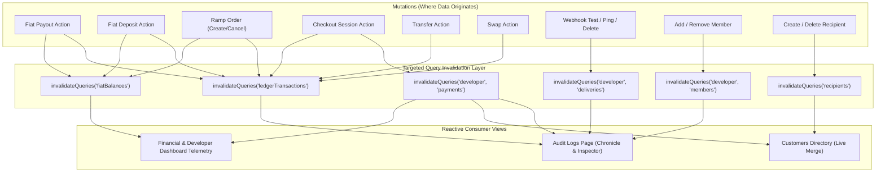

# Secondary Pages Live Data Orchestration: Customer Reconciliation & Unified Audit Trail

## Overview & Architectural Context

In modern fintech platforms, not every administrative view maps one-to-one with a single backend database table. In Bitnormous Merchant, two critical secondary views—**Customers** and **Audit Logs**—historically relied on static mock arrays (`paymentData.ts`) during early UI prototyping. 

To transition these views into production-grade, enterprise operational tools without requiring breaking modifications to the backend service contracts, we engineered a client-side **Multi-Stream Event Aggregation and Reconciliation Architecture**, eliminated redundant manual `localStorage` calls in favor of a persistent **Zustand Store**, and elevated loading and inspection states to enterprise UI standards.

---

## 1. Customers Orchestration & Zustand Store (`useCustomerStore`)

### The Architectural Question: Why Not Direct `localStorage`?
When an application already uses **Zustand** as its primary client-side state manager, writing manual `localStorage.getItem()`, `localStorage.setItem()`, and `JSON.parse()` routines inside React component hooks is an anti-pattern:
1. **Loss of Reactivity**: Changes written to `localStorage` do not automatically cause other components or hooks subscribed to that key to re-render without manual custom event listeners (`window.addEventListener('storage')`).
2. **Boilerplate & Deserialization Vulnerability**: Manually parsing JSON strings inside `useEffect` or `useState` initializers requires defensive `try/catch` wrappers and creates hydration drift between tabs or business switcher switches.
3. **State Centralization**: By defining a dedicated Zustand store with the official `persist` middleware, persistence is handled declaratively behind the scenes, while components enjoy granular selector-based reactive subscriptions:

```typescript
export const useCustomerStore = create<CustomerStoreState>()(
  persist(
    (set) => ({
      customCustomers: {},
      addCustomCustomer: (businessId, customerInput) =>
        set((state) => {
          const key = String(businessId);
          const list = state.customCustomers[key] || [];
          const newCustomer: CustomerRow = {
            ...customerInput,
            id: `cus-${Date.now()}`,
            addedOn: formatDisplayDate(),
          };
          const filtered = list.filter(
            (c) =>
              !c.email ||
              !customerInput.email ||
              c.email.trim().toLowerCase() !== customerInput.email.trim().toLowerCase()
          );
          return {
            customCustomers: {
              ...state.customCustomers,
              [key]: [newCustomer, ...filtered],
            },
          };
        }),
    }),
    {
      name: "bitnormous-customer-store",
      storage: createJSONStorage(() => localStorage),
    }
  )
);
```

### The Three-Source Customer Reconciliation Pipeline
The `useCustomersData` custom React hook unifies three distinct transactional streams into a deduplicated, cohesive directory:
1. **Checkout Session Payloads** (`GET /user/businesses/{id}/payments`): Real customers captured during hosted checkout sessions (`customer: { name, email, reference }`).
2. **Saved Address Book Recipients** (`GET /user/businesses/{id}/recipients`): Saved counterparties and bank/mobile-money accounts.
3. **Zustand Persisted Customers**: Registered directly by merchant operators via the "Add Customer" modal.

---

## 2. Professional Skeleton Design vs. Raw Text Placeholders

### Eliminating `"Loading..."` Text Placeholders
Rendering rows with raw text strings like `time: "Loading..."` and `activity: "Loading activity..."` breaks visual hierarchy, shifts layout widths during network requests, and degrades user confidence.

Instead, enterprise data tables employ **Column-Proportional Pulsing Skeletons**:
- **Timestamp Column**: Fixed-width pulsing block (`w-28` to `w-32`) matching the natural aspect ratio of dates.
- **Activity Column**: Fluid, alternating sentence-length pulsing bars (`w-4/5 max-w-lg` alternating with `w-3/5 max-w-md`) simulating natural paragraph sentences.
- **Configurable `skeletonClassName`**: Columns in `DataTableCard` now support explicit skeleton overrides for exact layout fidelity.

---

## 3. Audit Trail Multi-Stream Synthesis & Interactive Telemetry Inspector

### Real-Time Micro-Event Synthesis
Rather than waiting for a heavy centralized audit logging microservice, `useAuditLogsData` queries and normalizes four real-time reactive streams:

| Stream | Hook / Action | Event Synthesized | Status Representation |
| :--- | :--- | :--- | :--- |
| **Webhooks** | `useDeliveries` | Event dispatch attempt to merchant endpoints | `succeeded` (HTTP 200), `pending`, `failed` |
| **Orders** | `usePayments` | Checkout session creation, status lifecycle | `open`, `processing`, `completed`, `expired` |
| **Ledger** | `useLedgerTransactionsAction` | Settlement credits, payout debits, fees | Direction (`credit` / `debit`), amount, currency, bucket |
| **Team Access** | `useMembers` | Team member role bindings and invitations | Member name/email, assigned role (`admin`, `dev`, etc.) |

### Professional Telemetry Inspector (`AuditLogDetailInspector`)
Selecting any audit log in the chronicle transitions the inspection deck into a rich, interactive forensic console:
1. **Category Pills with Semantic Icons**:
   - `FaBolt` Indigo Pill: Webhook Dispatch
   - `FaCartShopping` Emerald Pill: Checkout Session
   - `FaWallet` Amber Pill: Ledger Settlement
   - `FaUserShield` Purple Pill: Access Control
2. **Status Indicator with Pulse**: Real-time status badges (`HTTP 200 OK`, `In Progress`, `Failed`) with animated glowing dots.
3. **Copyable Telemetry Specifications**: One-click clipboard copy for event IDs and target entity references with visual checkmark confirmation.
4. **Tabbed Inspector**:
   - **Structured Properties**: Key-value metadata table displaying balance after, bucket allocation, delivery attempts, and references.
   - **Raw JSON Console**: Formatted monospace payload viewer with a dedicated "Copy JSON" action for audit exports.
5. **Intuitive Empty State**: When no log is selected, renders a centered audit shield illustration with clear instructions to click any table row to inspect.

---

## 4. The Balances Fiat Paradigm: Eliminating Auto-Refresh in Favor of Reactive Query Invalidation

### Why Interval Polling & Auto-Refresh Fall Short
Historically, developers often resort to periodic background timers (e.g. `refetchInterval: 15_000`) or window focus re-fetching (`refetchOnWindowFocus: true`) in an attempt to keep administrative views fresh. In a high-traffic fintech dashboard, this pattern presents severe drawbacks:
1. **Visual Flicker & Render Thrashing**: Polling intervals trigger background state updates while the operator is inspecting a row or typing in a search bar, resulting in unexpected scroll jumps or component remounts.
2. **Bandwidth & Rate Limit Waste**: An operator leaving an audit log tab open generates dozens of unneeded requests per hour when nothing has changed.
3. **Redundant Manual Reload Buttons**: Placing a "Reload" button in secondary table toolbars shifts the burden onto the user, exposing an architectural admission that the system cannot reactively self-synchronize.

### The Event-Driven Invalidation Architectural Contract
Adopting the **Balances Fiat Paradigm** (proven in `useFiatBalancesAction`), queries operate with stable cache durations (`staleTime: 5 mins`, `refetchOnWindowFocus: false`, `refetchInterval: false`). The cache is **exclusively and predictably invalidated at the exact mutation source** where transactional data originates:



### Complete Invalidation Matrix

| Operational Mutation | Trigger Action | Query Keys Invalidated | Impacted Consumer Views |
| :--- | :--- | :--- | :--- |
| **Fiat Payout** | `useCreateFiatPayoutAction` | `fiatPayouts`, `fiatBalances`, `ledgerTransactions` | Payouts Table, Fiat Balances, Ledger, Audit Logs |
| **Fiat Deposit** | `useCreateFiatDepositAction` | `fiatDeposits`, `fiatBalances`, `ledgerTransactions` | Deposits, Fiat Balances, Ledger, Audit Logs |
| **Ramp Order** | `useCreateRampOrderAction`, `useCancelRampOrderAction` | `rampOrders`, `fiatBalances`, `custodyWallets`, `wallets`, `ledgerTransactions` | Ramp Orders, Balances, Ledger, Audit Logs |
| **Checkout Session** | `useCreatePaymentSessionAction` | `["developer", "payments"]`, `["developer", "overview"]`, `ledgerTransactions` | Payments, Customers, Metrics, Audit Logs |
| **Transfers & Swaps** | `useCreateTransferAction`, `useExecuteSwapAction` | `transfers`, `swaps`, `fiatBalances`, `custodyWallets`, `ledgerTransactions` | Transfers, Swaps, Balances, Ledger, Audit Logs |
| **Webhook Delivery / Test** | `useSendTestEventAction`, `useDeleteWebhookAction` | `webhookDeliveries`, `["developer", "deliveries"]`, `webhooks`, `["developer", "webhooks"]` | Webhooks Table, Delivery Log, Audit Logs |
| **Team Membership** | `useAddMember`, `useRemoveMember` | `["developer", "members"]` | Team Access Table, Audit Logs Access Events |
| **Saved Recipient** | `useCreateRecipientAction`, `useDeleteRecipientAction` | `recipients` | Address Book, Customers Directory |

### Zero-Flicker Selection State Preservation
When an operator is inspecting an audit log in `AuditLogDetailInspector`, background invalidations must not jarringly clear the selected log or reset scroll positions. In `AuditLogs.tsx`:
1. **Reactive ID Synchronization**: When `liveLogs` updates in the background, an effect locates the matching entry (`liveLogs.find(l => l.id === selectedLog.id)`) and updates the inspection deck seamlessly.
2. **Intentional Resets**: The selection card resets gracefully only when the operator explicitly changes the pagination page, applies a search filter, changes the sort direction, or switches businesses.
3. **Manual Reload Elimination**: The redundant reload button has been cleanly purged from `ListToolbar`.

---

## 5. Centralized Helper Architecture & Developer Mode Navigation Preservation

### A. The Helper Extraction Pattern
Defining inline formatting functions inside React component bodies or page scopes introduces code duplication, test fragmentation, and bundle bloat. We centralized all utilities into `@/helpers/`:
- **`auditLogUtils.tsx`**: Category visual tokens (`getAuditCategoryConfig`), table row pills (`getAuditCategoryBadge`), status dots (`getAuditStatusDot`), and telemetry badge decorators (`getAuditStatusBadge`).
- **`developerUtils.ts`**: Consolidated `formatMoney`, `trimCryptoAmount`, `prettyPrintJson`, `formatPercentFraction`, and `formatShortDate` across Developer views (`Transactions.tsx`, `Metrics.tsx`, `Logs.tsx`).
- **`listUtils.ts`**: Centralized `formatCustomerField` ensuring standard `"N/A"` fallbacks across table cells and exports.
- **`index.ts`**: Unified re-export hub for effortless import paths throughout the application.

### B. Additive Developer Mode Navigation
Navigation models must follow the **Additive Superset Principle**:
When switching between merchant personas (e.g. Normal Mode vs Developer Mode), core business capabilities must never disappear. 
In `sidebarConfig.ts`, `Customers` (`/customers`) and `Business Account` (`/get-started`) were retained under the `INTEGRATION` group in Developer Mode, allowing engineers to test checkout records and view merchant credentials without toggling between modes.

---

## 6. High-Assurance Security Architecture & Type Contracts

### A. CSV Formula & Macro Injection Defense (OWASP / CWE-1236)
In `escapeCsvValue`, cell strings exported to spreadsheet software (Excel, LibreOffice, Google Sheets) are sanitized. Any value starting with formula execution triggers (`=`, `+`, `-`, `@`, `\t`, `\r`) is safely prefixed with an apostrophe (`'`), preventing DDE command execution or malicious hyperlink triggering when merchants download transaction and customer records.

### B. Recursive Privacy & Sensitive Credential Redaction
In `sanitizeAuditPayload`, telemetry payloads are recursively scrubbed before operator inspection or clipboard export:
1. **Internal ID Stripping**: Database-internal identifiers (`user_id`, `userId`) are omitted entirely, protecting multi-tenant integrity.
2. **Credential Redaction**: Tokens, passwords, cookies, and secret keys matching sensitive security patterns are masked with `"••••••••"`, preventing credential leakage in client-side telemetry views.

### C. Generic Component Type Safety (`<Segmented<T>>`)
Passing React state dispatchers (`Dispatch<SetStateAction<T>>`) to generic callbacks expecting `(value: T) => void` causes TypeScript TS2322 errors when array options widen to `string`. Explicit parameterization `<Segmented<ReportingWindow>>` and arrow-wrapped handlers guarantee compile-time type safety.

---

## 7. Verification & Clean Build

All components passed strict TypeScript compilation (`tsc -b`) and Vite production bundling with **0 errors**.

